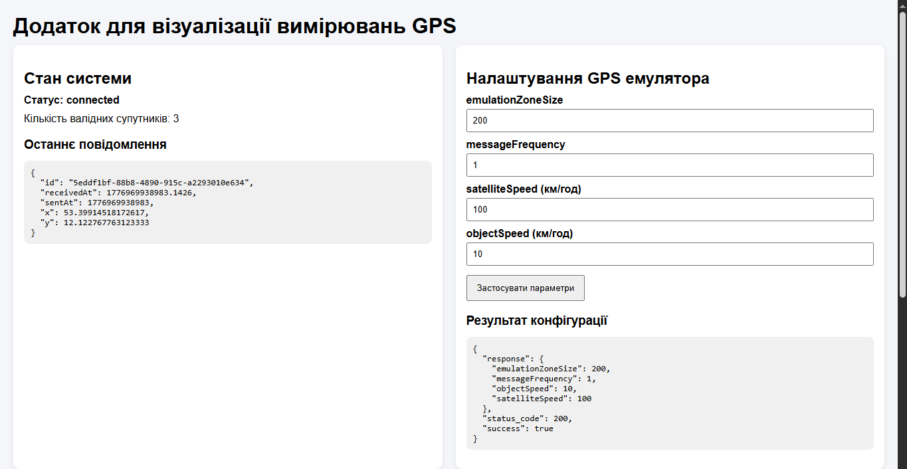
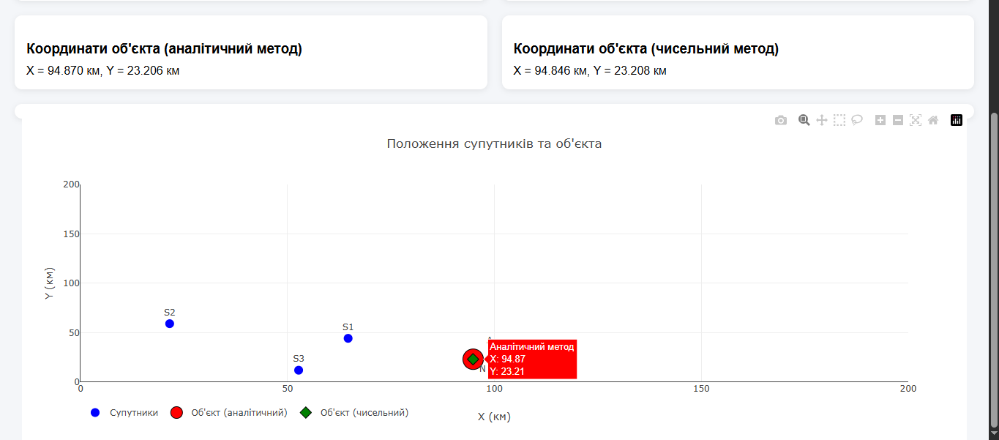
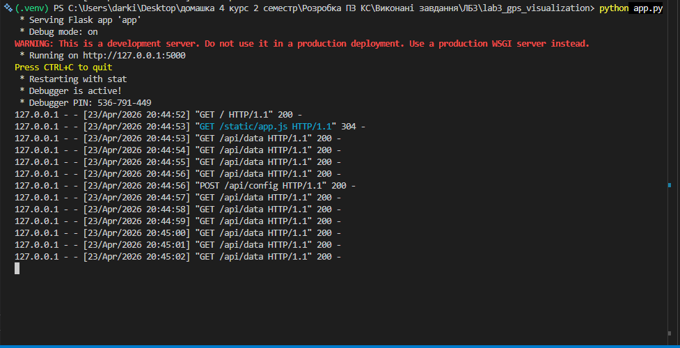

# Лабораторна робота №3  
## Розробка додатку для візуалізації вимірювань GPS

## 1. Короткий опис роботи

Мета роботи — розробити веб-додаток, який зчитує дані з емульованої вимірювальної частини GPS, розраховує положення об'єкта двома методами — аналітичним та чисельним — і відображає положення об'єкта та супутників на графіку в декартових координатах.

У межах роботи було реалізовано:
- підключення до GPS-емулятора через WebSocket;
- обробку повідомлень у форматі JSON;
- розрахунок відстані до супутника на основі часу передачі сигналу;
- аналітичний метод розрахунку положення об'єкта;
- чисельний метод розрахунку положення об'єкта за допомогою `scipy.optimize.minimize`;
- відображення супутників та двох положень об'єкта на одному графіку;
- зміну параметрів емулятора через API;
- веб-інтерфейс для зручної роботи з додатком.

Додаток реалізовано на Python з використанням Flask. Для чисельної оптимізації використовується SciPy, а для візуалізації графіка — Plotly.

---

## 2. Інструкції для запуску проєкту

### Вимоги до середовища
- Python 3.14+
- Docker
- Visual Studio Code або інше Python-сумісне середовище

### Структура проєкту
- `app.py` - Flask-додаток і HTTP API;
- `gps_client.py` - підключення до WebSocket та накопичення валідних супутників;
- `solver.py` - обчислення відстаней, аналітичний і чисельний методи;
- `templates/index.html` - HTML-сторінка;
- `static/app.js` - логіка оновлення графіка і форми конфігурації;
- `requirements.txt` - список залежностей.

### Підготовка середовища

1. Створити віртуальне середовище:

```bash
python -m venv .venv
```

2. Активувати його:

```bash
.venv\Scripts\activate
```

3. Встановити залежності:

```bash
pip install -r requirements.txt
```

### Запуск GPS-емулятора

1. Завантажити Docker image:

```bash
docker pull iperekrestov/university:gps-emulation-service
```

2. Запустити контейнер:

```bash
docker run --name gps-emulator -p 4001:4000 iperekrestov/university:gps-emulation-service
```

### Запуск веб-додатка

У корені проєкту виконати:

```bash
python app.py
```

Після запуску відкрити у браузері адресу:

http://127.0.0.1:5000

## 3. Принцип роботи додатка

GPS-емулятор надсилає через WebSocket повідомлення у форматі JSON, які містять:
- `id` - ідентифікатор супутника;
- `x`, `y` - координати супутника;
- `sentAt` - час відправки сигналу;
- `receivedAt` - час отримання сигналу.

На основі різниці між `receivedAt` і `sentAt` обчислюється відстань до супутника. Після цього на основі валідних супутників виконується визначення положення об'єкта двома способами:
- аналітичний метод — прямий розв'язок системи рівнянь;
- чисельний метод — мінімізація сумарної похибки через `scipy.optimize.minimize`.

На графіку одночасно відображаються:
- супутники;
- положення об'єкта, знайдене аналітичним методом;
- положення об'єкта, знайдене чисельним методом.

---

## 4. Реалізований функціонал

У додатку реалізовано:
- підключення до WebSocket сервера `ws://localhost:4001`;
- фільтрацію некоректних GPS-повідомлень;
- накопичення валідних супутників;
- обчислення положення об'єкта аналітичним методом;
- обчислення положення об'єкта чисельним методом;
- відображення супутників і двох результатів на одному графіку;
- показ кількості валідних супутників;
- відображення координат об'єкта обома методами;
- форму для зміни параметрів емулятора:
  - `emulationZoneSize`
  - `messageFrequency`
  - `satelliteSpeed`
  - `objectSpeed`

---

## 5. Результати роботи

Під час перевірки було підтверджено:
- коректне підключення до WebSocket сервера;
- успішне зчитування повідомлень від GPS-емулятора;
- правильну фільтрацію невалідних повідомлень;
- коректне накопичення валідних супутників;
- успішний розрахунок координат об'єкта двома методами;
- одночасне відображення супутників та двох точок об'єкта на одному графіку;
- коректну зміну параметрів емулятора через API.

Приклад отриманого результату:
- аналітичний метод: `X = 93.870 км, Y = 23.206 км`
- чисельний метод: `X = 93.846 км, Y = 23.208 км`

Отримані значення є дуже близькими між собою, що підтверджує правильність реалізації обох підходів.

### Скріншоти сторінок додатка




### Скріншот консолі Flask



---

## 6. Висновок

У ході виконання лабораторної роботи було закріплено навички створення веб-додатків на Python, роботи з Flask, WebSocket, HTTP API, а також реалізації аналітичних і чисельних методів обчислення координат.

Було створено додаток, який у реальному часі отримує дані від GPS-емулятора, накопичує валідні супутники, виконує обчислення положення об'єкта двома методами та відображає результати на одному графіку. Отримані результати показали, що аналітичний і чисельний підходи дають близькі значення координат, що підтверджує коректність реалізації.